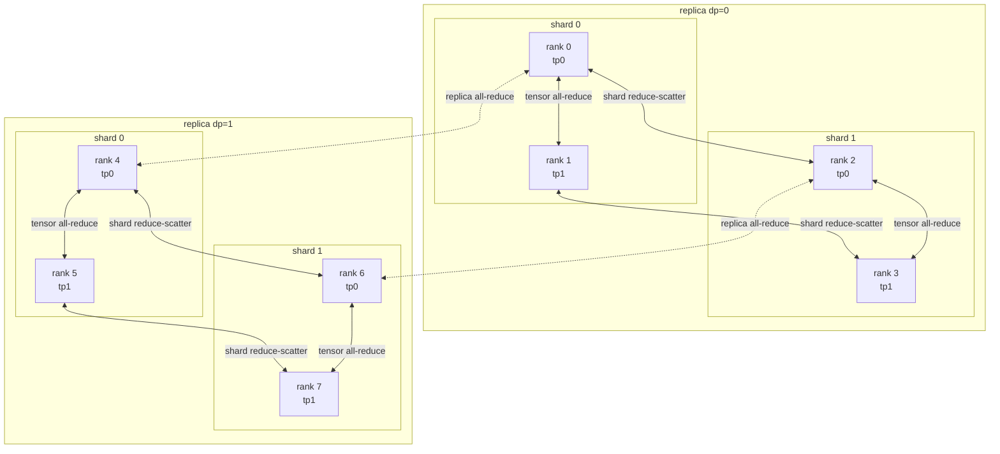

# 01 — Distributed systems foundations

> Implemented by `distributed/topology.py`, `distributed/groups.py`,
> `distributed/context.py`, `distributed/launch.py`.
> Tested by `tests/unit/test_topology.py`,
> `tests/distributed/test_collectives.py::TestProcessGroups`.

---

## 1. The problem

A distributed training job is `W` processes that must agree, at every step, on
*which* collective to run, *on which group*, and *in what order*. There is no
central coordinator. Every rank makes its decisions locally, and correctness
depends on those local decisions coinciding.

When they do not coincide, the failure mode is almost never an exception. It is
a **hang**: one rank posts an all-reduce, its peers post something else or
nothing, and everyone waits until a timeout fires minutes later with a message
that names neither the operation nor the rank that went wrong.

Everything in this document exists to make that class of failure structurally
impossible or, failing that, loudly diagnosable.

---

## 2. Ranks and coordinates

A rank is an integer in `[0, W)`. This project treats it as a **mixed-radix
number** over four digits:

```
rank = ((dp · S + sh) · Q + sq) · T + tp

  dp ∈ [0, data_parallel_size)      most significant  (slowest varying)
  sh ∈ [0, shard_parallel_size)     S = shard_parallel_size
  sq ∈ [0, sequence_parallel_size)  Q = sequence_parallel_size
  tp ∈ [0, tensor_parallel_size)    least significant (fastest varying)
```

Decomposition is the obvious inverse:

```python
tp = rank % T;  r = rank // T
sq = r % Q;     r = r // Q
sh = r % S
dp = r // S
```

### Why this digit order

Numerically adjacent ranks are usually topologically adjacent: they share a
node, then a NUMA domain, then an NVLink island. The dimension with the highest
traffic per step therefore belongs in the least significant digit.

| Dimension | Traffic per training step |
|---|---|
| tensor parallel | 2 collectives **per layer** over full activations |
| sequence parallel | 1–2 collectives per layer over activations |
| FSDP shard | 1 all-gather + 1 reduce-scatter **per unit** over parameters |
| data parallel | 1 all-reduce **per step** over gradients |

Hence `tensor` innermost, `data_parallel` outermost. A hybrid-sharded job then
shards *within* a node and replicates *across* nodes without the operator
having to arrange anything.

### Worked example: 8 ranks, `dp=2 × shard=2 × tensor=2`

```
rank | dp sh sq tp | data_parallel | shard  | tensor | dp_shard
-----+-------------+---------------+--------+--------+--------------
  0  |  0  0  0  0 | (0, 4)        | (0, 2) | (0, 1) | (0, 2, 4, 6)
  1  |  0  0  0  1 | (1, 5)        | (1, 3) | (0, 1) | (1, 3, 5, 7)
  2  |  0  1  0  0 | (2, 6)        | (0, 2) | (2, 3) | (0, 2, 4, 6)
  3  |  0  1  0  1 | (3, 7)        | (1, 3) | (2, 3) | (1, 3, 5, 7)
  4  |  1  0  0  0 | (0, 4)        | (4, 6) | (4, 5) | (0, 2, 4, 6)
  5  |  1  0  0  1 | (1, 5)        | (5, 7) | (4, 5) | (1, 3, 5, 7)
  6  |  1  1  0  0 | (2, 6)        | (4, 6) | (6, 7) | (0, 2, 4, 6)
  7  |  1  1  0  1 | (3, 7)        | (5, 7) | (6, 7) | (1, 3, 5, 7)
```

Read row 3 as: *rank 3 holds tensor slice 1 of shard 1 of replica 0.* Its
gradient shard is all-reduced with rank 7 (the other replica of the same
shard and slice), reduce-scattered with rank 1 (the other shard of the same
replica and slice), and its activations are all-reduced with rank 2 (the other
tensor slice).

This exact table is asserted by
`tests/unit/test_topology.py::TestCoordinates::test_documented_eight_rank_example`.



---

## 3. Process groups

A **group** along dimension *d* holds every rank whose coordinates match in all
*other* dimensions. `ParallelTopology.all_group_rank_lists(d)` enumerates every
such group; together they partition `range(W)`.

Two **composite** groups matter enough to be named:

- **`dp_shard`** — every rank that processes a *different* slice of the global
  batch. Losses and metrics are averaged over this group. Averaging over the
  world instead would weight each sample by the tensor-parallel size.
- **`tensor_sequence`** — every rank collaborating on the *same* batch slice.
  These ranks **must** receive identical input.

Plus `world`, which exists so that code genuinely needing a global collective
(the gradient norm) can *name* it rather than pass `None`.

### Why creation order is a correctness property

`torch.distributed.new_group` is a **collective**. Every process in the default
group must call it the same number of times, with the same rank lists, in the
same order. The backend assigns each new group an implicit sequence number and
uses it as part of the communicator identity; NCCL additionally exchanges a
unique id through the rendezvous store under a key derived from that number.

If rank 0 creates `[0,1]` then `[0,2]` while rank 2 creates `[0,2]` then
`[0,1]`, the two processes end up holding communicators that disagree about
who is in them. Nothing raises. The next collective hangs.

This project removes the possibility:

- `GROUP_CREATION_ORDER` fixes the order of the named dimensions.
- `all_group_rank_lists` returns groups sorted by their smallest member.
- Every rank walks the same nested loop and calls `new_group` for **every**
  group, member or not — that is what "collective" means here — keeping only
  the handle for the group it belongs to.

`ProcessGroupRegistry.creation_log` records every `(name, ranks)` pair, and
`tests/distributed/test_collectives.py::TestProcessGroups::test_every_rank_builds_groups_in_the_same_order`
asserts that all ranks produce byte-identical logs.

The single shortcut taken is that a group whose rank list is the whole world
reuses the default communicator instead of creating a new one. That decision
depends only on the rank list, so it is identical on every rank and cannot
desynchronise anything.

---

## 4. The distributed context

`DistributedContext` owns exactly four things: the launch environment, the
backend, this rank's device, and the group registry. It is the *only* place
where process-group handles live. Every subsystem receives it explicitly
through its constructor; nothing reaches for a global.

There is one module-level slot, `_ACTIVE_CONTEXT`, written only by
`init_distributed` and `DistributedContext.shutdown`. It exists so that scripts
and error messages can find the context without threading it through, and
so that double initialisation can be *detected*:

```python
>>> ctx = init_distributed(TopologyConfig(data_parallel_size=2), backend="gloo")
>>> init_distributed(TopologyConfig(data_parallel_size=2), backend="gloo")
DistributedInitializationError: [rank 0/2] context.init_distributed: a distributed
context is already active in this process; ... Fix: call shutdown() on the existing
context first, or use the distributed_context() context manager which does it for you
```

### Launch modes

| Mode | How the rendezvous is found |
|---|---|
| `torchrun` | `RANK`, `LOCAL_RANK`, `WORLD_SIZE`, `LOCAL_WORLD_SIZE`, `MASTER_ADDR`, `MASTER_PORT` from the environment |
| Explicit | `rank=`/`world_size=`/`master_port=` arguments; no environment needed |
| Single process | Nothing set: rank 0 of 1 on a private free port |

The single-process mode is not a special case in the *library*: a real Gloo
process group is created, every collective executes, and each one is an
identity operation over a one-member group. That is what makes the
single-process reference in the equivalence tests meaningful — it exercises the
same code as the distributed run rather than a separate branch.

### Backend and device resolution

| Request | Behaviour |
|---|---|
| `nccl` + fewer GPUs than local ranks | **Error.** Two ranks sharing one GPU hangs rather than failing, so it is refused up front. |
| `nccl` + no CUDA | **Error**, naming the device count observed. |
| `gloo` + `cuda` | **Error.** Gloo on CUDA tensors supports few collectives and is never the right choice. |
| `auto` + enough GPUs | NCCL on `cuda:local_rank`. |
| `auto` + too few GPUs | Gloo on CPU, with a `WARNING` that names both counts. |

The last row is a *visible* fallback, never a silent one:

```
WARNING backend='auto': 1 CUDA device(s) visible but 4 local processes requested;
        falling back to gloo/cpu because NCCL cannot share a device between ranks
```

The CUDA device is selected with `torch.cuda.set_device` **before**
`init_process_group`. Skipping that is a classic deadlock: every rank
bootstraps NCCL on device 0 and the job wedges on the first collective.

### Teardown order

`shutdown()` destroys sub-communicators first, then the default group. The
reverse order lets NCCL abort while tearing down a communicator whose bootstrap
store has already gone away. It is idempotent and safe from an exception
handler; `distributed_context()` calls it from a `finally` block.

---

## 5. Launching for tests

`torchrun` is right for real jobs. It is wrong for a test suite: process
startup dominates, the assertions live in the parent, and a hung child needs a
*diagnosis* rather than a wall-clock timeout on the whole run.

`launch_workers` fills that gap. It spawns `world_size` children on a private
port, runs a plain function in each, and collects either the return value or
the full traceback from every rank. Three details are load-bearing:

1. **Drain before join.** A full pipe blocks the child in `put`; a parent that
   joined first would deadlock against it.
2. **Plain pickle, not the queue's `ForkingPickler`.** torch registers reducers
   with `ForkingPickler` that move tensor storage through shared-memory file
   descriptors, valid only while the *sending* process is alive. A worker that
   returns a tensor and then exits races the parent's read and intermittently
   fails with `ConnectionResetError: [Errno 104]`. Plain `pickle.dumps`
   serialises the bytes inline, so the payload is self-contained. This was a
   real bug found while building the reshard tests.
3. **Ranks that never report are named.** On timeout the failure lists which
   ranks produced no result — precisely the set stuck in a collective.

```
WorkerFailure: launch.launch_workers: 2 of 4 worker(s) timed out;
expected 'every rank to return normally with exit code 0',
observed 'failing ranks: [1, 3]'. Fix: read the per-rank tracebacks below;
a rank with no traceback was blocked in a collective
--- rank 0: ok (exit_code=0, 1.83s) ---
--- rank 1: FAILED (exit_code=None, 0.00s) ---
rank produced no result: it was still running when the timeout expired ...
```

---

## 6. Invariants

1. Every rank enumerates the same groups in the same order.
2. Every collective names its group explicitly; there is no default.
3. The CUDA device is set before the backend initialises.
4. Sub-communicators are destroyed before the default group.
5. One active context per process, enforced rather than assumed.
6. World size 1 runs the distributed code path, not a bypass.

---

## 7. Comparison with PyTorch

| Concern | PyTorch | This project |
|---|---|---|
| Multi-dimensional layout | `DeviceMesh` | `ParallelTopology` — pure arithmetic, unit-testable without a process group |
| Group creation | ad hoc `new_group` calls, or mesh-managed | one registry, one fixed order, logged |
| Default group | pervasive `group=None` | no defaults anywhere |
| Backend selection | user's responsibility | validated, with impossible combinations refused |

`DeviceMesh` is the better production abstraction — it integrates with DTensor
and handles sub-mesh slicing. `ParallelTopology` is deliberately smaller: it
does rank arithmetic and nothing else, which is what makes every coordinate
calculation testable in a single process.
