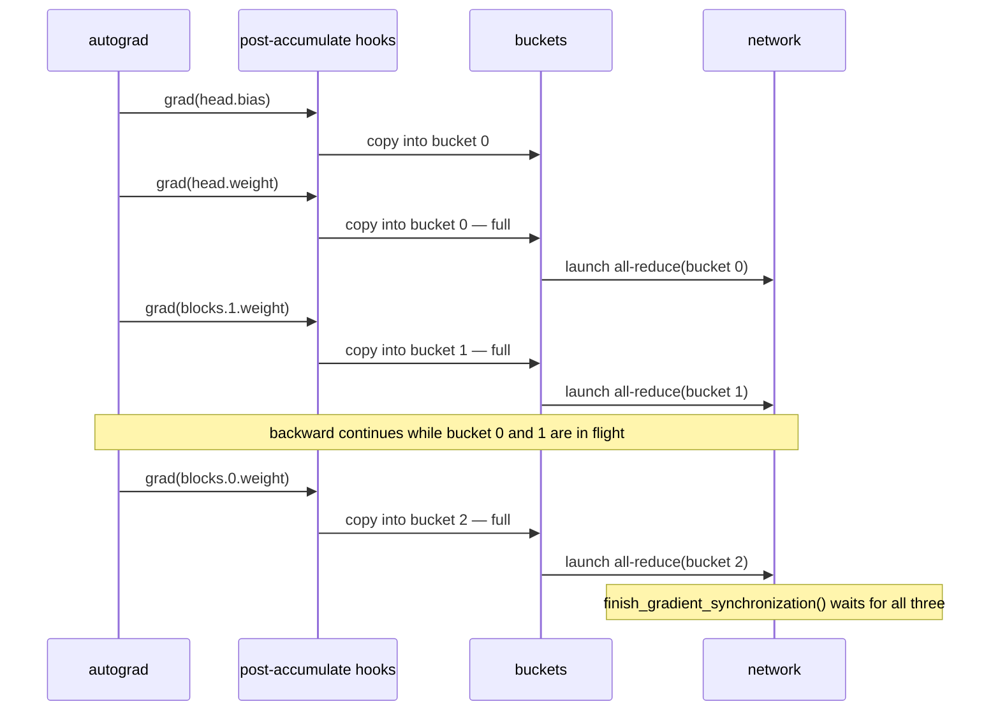
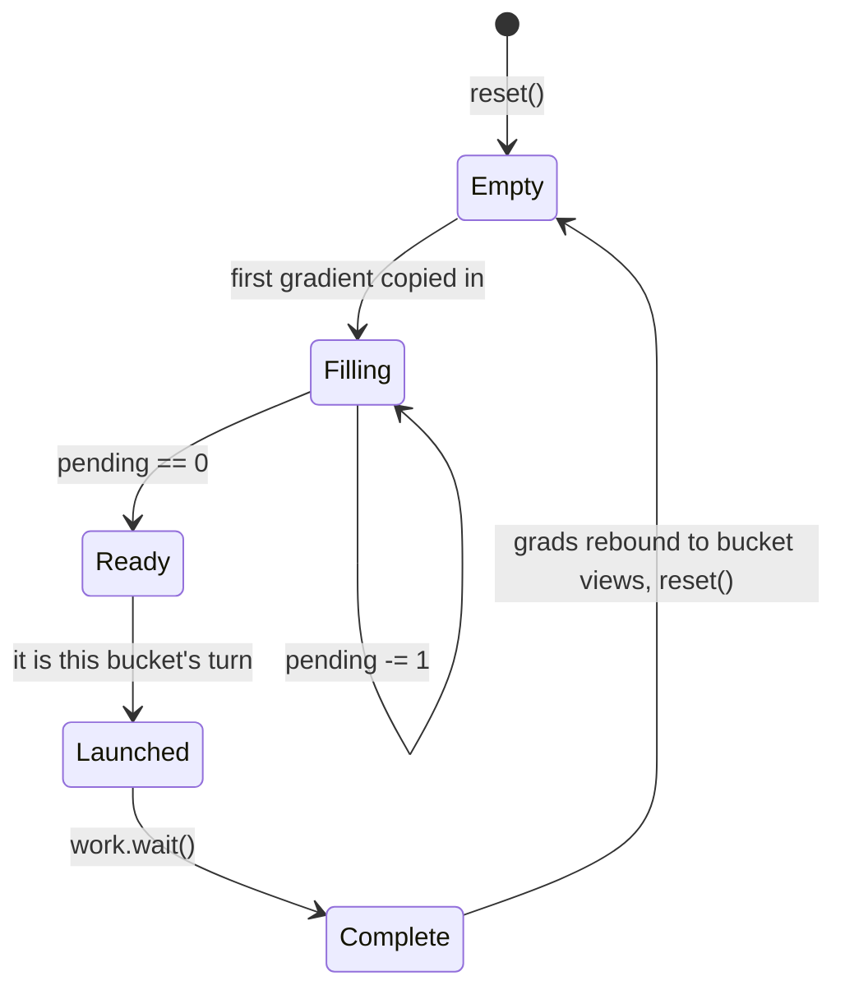

# 03 — Distributed data parallel

> Implemented by `parallel/ddp.py`.
> Tested by `tests/distributed/test_ddp.py`,
> `tests/unit/test_single_process_components.py::TestDDPBuckets`.

---

## 1. The mathematics, which is one line

Every rank holds a complete copy of the model and processes a different slice
of the global batch. If rank `r` computes the loss `L_r` as the mean over its
own `B` samples, then the gradient of the *global* mean loss over `R·B` samples
is

```
∇L = (1/R) Σ_{r=0}^{R−1} ∇L_r
```

So the only thing DDP must do is **average the gradients across ranks before
the optimizer steps**. Everything else in this file is performance engineering
around that equation.

Two consequences that trip people up:

- **Summing instead of averaging** makes every gradient `R` times too large,
  which is exactly equivalent to multiplying the learning rate by `R`. That is
  a legitimate choice (`DDPConfig(average_gradients=False)`) but it must be a
  choice, not an accident.
- **Unequal per-rank batches** break the identity: the average of per-rank
  *means* is not the mean over the global batch. Correct handling requires
  weighting by sample count. This implementation requires equal per-rank
  batches, and `DistributedBatchSampler` enforces it by dropping a trailing
  partial global batch rather than producing a short one.

---

## 2. Parameters must start identical

Averaging gradients keeps replicas identical only *by induction*: if they start
equal and always apply the same update, they stay equal. If they start
different, averaged gradients applied to different starting points give
different results forever, and the job trains a different model on every rank
while looking perfectly healthy.

`DistributedDataParallel.__init__` therefore broadcasts every parameter and
buffer from the group source. The test deliberately initialises each rank with
a *different* seed and asserts they agree afterwards
(`TestParameterSynchronisation::test_initial_parameters_are_broadcast`).

`verify_replica_consistency()` re-checks at any point, with `atol=0` — on one
machine with a deterministic reduction order, bitwise equality is the right
expectation.

---

## 3. Overlapping communication with computation

Backward runs from the output towards the input, so the *last* layer's gradient
is ready long before the *first* layer's. A naive implementation waits for the
whole backward pass and then issues one giant all-reduce:

```
compute:  [====== backward ======]
network:                          [==== all-reduce ====]
```

Bucketing fixes this. Parameters are grouped into fixed buckets in
*approximately reverse* forward order — which is approximately the order
gradients become ready — and each bucket's all-reduce is launched as soon as
every parameter in it has a gradient:

```
compute:  [=== backward ===]
network:      [=b3=][=b2=][=b1=][=b0=]
```



### The bucket lifecycle



### Choosing the cap

`bucket_cap_mb` trades overlap against efficiency. Larger buckets mean fewer,
bigger collectives — better bandwidth utilisation, worse overlap. Smaller
buckets let the first all-reduce start earlier. `25` matches PyTorch's default.

The last bucket to fill cannot overlap with anything, which is why production
implementations deliberately make the *first* bucket in reverse order (holding
the last layers) smaller.

`TestGradientEquivalence::test_bucket_size_does_not_change_the_result` runs the
same comparison at caps of 0.0001, 0.001 and 25 MiB and asserts identical
gradients: bucketing is a scheduling choice, never a numerical one.

---

## 4. Bucket ordering is a correctness property

Collectives issued on the same process group must be issued in the same order
on every rank. Gradient *readiness* order can differ between ranks — an
autograd hook firing slightly differently, a conditional branch, a parameter
that happened to be a graph leaf — so "reduce whichever bucket fills first" is
**not safe**.

This implementation keeps a launch pointer: bucket `k` is only launched once
buckets `0…k−1` have been. Buckets that fill out of order are marked ready and
wait their turn:

```python
while (self._next_bucket_to_launch < len(self._buckets)
       and self._buckets[self._next_bucket_to_launch].ready):
    self._launch(self._buckets[self._next_bucket_to_launch], async_op=True)
    self._next_bucket_to_launch += 1
```

That costs a little overlap in exchange for making the collective order
identical on every rank *by construction*. `statistics.out_of_order_buckets`
counts how often it happened, so a poor bucket order is visible rather than
merely slow.

---

## 5. Which hook, and why

`param.register_post_accumulate_grad_hook` fires **after** autograd has written
`param.grad`. That is exactly when the value is safe to copy.

A plain `register_hook` on the tensor fires when the gradient is *computed*,
before accumulation, and would therefore miss contributions from a parameter
used more than once in the graph — a tied embedding, a weight applied twice.
The bug would show up as a gradient that is too small by exactly the number of
uses.

Tied weights are handled by deduplicating on identity: a parameter appearing
twice in `named_parameters()` is placed in one bucket once, so its
already-summed gradient is reduced exactly once.

---

## 6. The synchronisation boundary

The optimizer must not step until every bucket's all-reduce has completed. In
this implementation the boundary is an **explicit call**:

```python
loss.backward()
ddp.finish_gradient_synchronization()   # <-- the boundary
optimizer.step()
```

PyTorch's DDP hides this behind an autograd engine callback. Making it explicit
is a deliberate teaching decision: it is the single most important line in the
training loop, and a missing one is caught here by a guard in `forward` rather
than by silently training on unreduced gradients:

```
ShardingError: [rank 0] ddp.forward: a previous backward pass has not been
synchronised; stepping now would use gradients that were never averaged across
ranks; expected 'finish_gradient_synchronization() after every backward()',
observed 'pending bucket reductions'. Fix: call
ddp.finish_gradient_synchronization() before the next forward, or use the
TrainingEngine which does it for you
```

`finish_gradient_synchronization` does four things:

1. fills zero gradients for unused parameters (when enabled) so all ranks
   reduce the same buckets;
2. launches any bucket not launched during backward, in index order;
3. waits for every in-flight all-reduce;
4. re-points each `param.grad` at its slice of the reduced bucket.

Step 4 is PyTorch's `gradient_as_bucket_view=True` behaviour: the optimizer
then reads directly out of the communication buffer with no copy back.

---

## 7. `no_sync()` and gradient accumulation

Run `N−1` micro-batches inside `no_sync()` and the last one outside it.
Gradients accumulate into `param.grad` throughout, and the single all-reduce on
the final micro-batch averages the *sum* over all micro-batches — which is
exactly the gradient of the `N`-times larger effective batch.

```python
for i, batch in enumerate(micro_batches):
    context = ddp.no_sync() if i < len(micro_batches) - 1 else nullcontext()
    with context:
        (ddp(batch).mean() / len(micro_batches)).backward()
ddp.finish_gradient_synchronization()
```

The saving is real and measured:
`tests/performance/test_instrumentation.py::test_accumulation_reduces_communication`
asserts that four micro-batches with `no_sync` move exactly one quarter of the
bytes that four synchronised steps move.

Implementation: when `require_backward_grad_sync` is `False` the hooks return
immediately, so the buckets are never touched and gradients simply pile up in
`param.grad`.

---

## 8. Unused parameters

A parameter that receives no gradient leaves its bucket permanently incomplete,
so that bucket's all-reduce is never issued — and every other rank blocks
forever waiting for it.

With `find_unused_parameters=False` (the default) this is detected and reported
instead:

```
ShardingError: [rank 0/2] ddp.finish_gradient_synchronization: some parameters
received no gradient, so their buckets can never become ready and the all-reduce
would never be issued (every other rank would block waiting for it);
expected 'every trainable parameter to receive a gradient',
observed "1 without gradients: ['unused.weight']".
Fix: set DDPConfig(find_unused_parameters=True), or stop marking unused
parameters as requires_grad=True
```

With `find_unused_parameters=True`, missing gradients contribute explicit zeros
so every rank reduces the same buffers. This matters when the *set* of unused
parameters differs per rank: rank A used a parameter and rank B did not, so B
must contribute zeros and both must end up with the average.

Cost: one extra pass over the parameter list per step. Leave it off when the
graph is static.

---

## 9. Buffers

Buffers (BatchNorm running statistics and the like) are updated by the forward
pass rather than by the optimizer, so they drift apart across replicas unless
explicitly re-synchronised. With `broadcast_buffers=True` they are broadcast
from the source rank at the *start* of each forward, so the statistics used for
the step are the source's — matching PyTorch DDP.

---

## 10. Equivalence results

Measured on this repository, MLP with 12→24×3→6, world sizes 2 and 4, Gloo:

| Comparison | Maximum absolute gradient difference |
|---|---|
| custom DDP vs single-process reference (`W=2`) | `1.5e-08` |
| custom DDP vs `torch.nn.parallel.DistributedDataParallel` (`W=2`) | `0.0` |
| custom DDP vs single-process reference (`W=4`) | `7.5e-09` |
| custom DDP vs PyTorch DDP (`W=4`) | `1.9e-09` |
| `no_sync` accumulation vs one large batch | `1.5e-08` |

The `0.0` against PyTorch DDP at world size 2 is not luck: both implementations
divide by the group size *before* summing, so the arithmetic is identical
operation for operation.

---

## 11. Deadlock scenarios, and how each is prevented

| Scenario | Prevention |
|---|---|
| Ranks build different buckets | bucket layout is all-gathered and compared at construction |
| Buckets reduced in different orders | launch pointer enforces index order |
| A rank has an extra/missing parameter | `(name, shape, dtype)` list compared collectively at construction |
| One rank has an unused parameter | detected at the boundary and reported, or zero-filled |
| A rank skips `backward` entirely | its peers block; the launcher's timeout names it as "produced no result" |
| `optimizer.step()` before the boundary | guard in `forward` raises on the *next* iteration |

---

## 12. Comparison with PyTorch DDP

| Concern | PyTorch | This project |
|---|---|---|
| Bucket construction | C++ `Reducer`, rebuilt after the first iteration using observed autograd order | Python, static, reverse `named_parameters()` order |
| Reduction ordering | index order, same guarantee | index order, with a counter exposing violations |
| Synchronisation boundary | autograd engine callback, invisible | explicit call, guarded |
| Unused parameters | graph traversal to find them | zero-fill at the boundary |
| Gradient views | `gradient_as_bucket_view` option | always |
| Comm hooks | `register_comm_hook` for compression etc. | not implemented |

PyTorch's rebuild-after-first-iteration is the notable missing optimisation: it
observes the *actual* autograd firing order and re-buckets to match, which
improves overlap for models whose backward order differs from reverse
definition order. Implementing it would obscure the mechanism, so this project
uses the static approximation and measures the cost via
`out_of_order_buckets`.
