# 04 — FSDP-style sharding

> Implemented by `parallel/fsdp.py`, `optim/sharded_optimizer.py`.
> Tested by `tests/distributed/test_fsdp.py`,
> `tests/performance/test_instrumentation.py::TestMemoryScaling`.

---

## 1. The memory problem

Plain data parallelism replicates everything. Per rank, for `P` parameters
trained in fp32 with Adam:

| Item | Bytes |
|---|---|
| parameters | `4P` |
| gradients | `4P` |
| `exp_avg` | `4P` |
| `exp_avg_sq` | `4P` |
| **total** | **`16P`** |

A 7-billion-parameter model therefore needs **112 GB per rank** before a single
activation is stored. Adding ranks does not help: every rank holds the same
112 GB.

Full sharding divides all four rows by the shard-group size `G`:

```
persistent = 16P / G   +   transient all-gather buffers
```

With `G = 64` the same model needs 1.75 GB of persistent state per rank. The
transient term is the cost: a unit's parameters must be *whole* to compute
with, so they are gathered just before use and dropped just after.

| Strategy | Persistent per rank | Transient |
|---|---|---|
| data parallel | `16P` | 0 |
| full sharding | `16P/G` | `4·max_unit_numel·(1 or 2)` |
| hybrid (shard `G`, replicate `R`) | `16P/G` | same |

Note the last row: **hybrid sharding buys communication locality, not memory.**
Memory scales with the *shard* group only.

`estimate_training_memory()` implements this model, and
`TestMemoryScaling::test_analytical_model_matches_the_measurement` asserts the
formula agrees with what the code actually holds, to within 2 %.

---

## 2. The flat parameter

Each FSDP **unit** owns one flat parameter: the concatenation of its
parameters' elements, padded to a multiple of `G`, of which each rank
persistently stores exactly `1/G`.

```
p0: shape (2, 3), numel 6      offsets [0, 6)
p1: shape (4,),   numel 4      offsets [6, 10)
p2: shape (3, 2), numel 6      offsets [10, 16)
                               total numel 16
```

With `G = 3`, 16 pads to 18 and each rank keeps 6 elements:

```
rank 0: flat[0:6]    -> all of p0
rank 1: flat[6:12]   -> all of p1, plus the first 2 elements of p2
rank 2: flat[12:18]  -> the last 4 elements of p2, plus 2 padding slots
```

Two facts fall out of this picture and drive most of the implementation:

1. **A parameter can straddle a shard boundary**, so "which rank owns parameter
   *p*" is not a well-posed question. Ownership is per *element*.
2. **Padding exists only in the flat buffer.** It is never exposed to the
   optimizer as a trainable value, it is always zero in a gradient, and it is
   dropped when a full state dict is reconstructed.

### Why equal-sized shards

All shards have the *same* length `ceil(total/G)`, even when that means the
last one is mostly padding. That is what lets `all_gather_into_tensor` and
`reduce_scatter_tensor` be used directly — both require equal contributions.
The alternative (uneven list-based collectives) costs an extra allocation per
rank for the same result.

`FSDPConfig(use_padding=False)` is rejected at construction with an explanation
rather than silently ignored.

---

## 3. The lifecycle

```mermaid
stateDiagram-v2
    [*] --> Sharded: construction
    Sharded --> Unsharded: all-gather (forward)
    Unsharded --> Computing: bind views to module attributes
    Computing --> Sharded: reshard_after_forward — free storage
    Sharded --> Unsharded2: all-gather (pre-backward hook)
    Unsharded2 --> Backward: gradients accumulate into one flat buffer
    Backward --> Reduced: reduce-scatter over the shard group
    Reduced --> Replicated: all-reduce over the replica group (hybrid only)
    Replicated --> Sharded: free full buffer; flat_param.grad is the local shard
    Sharded --> [*]: optimizer updates 1/G
```



```text
idle          rank r holds flat_param[r·S : (r+1)·S]        (S = padded/G)
  |
  | forward starts
  v
all-gather    full = concat over ranks           -> padded_numel elements
  |           views bound to the modules' .weight/.bias attributes
  v
forward       ordinary computation on whole tensors
  |
  | reshard_after_forward: free full's storage (views stay valid objects)
  v
idle again    only the 1/G shard is resident
  |
  | backward reaches this unit
  v
all-gather    refill full's storage in place, so the tensors autograd saved
  |           during forward point at correct data again
  v
backward      gradients accumulate into one padded_numel flat gradient
  |
  v
reduce-scatter  sum across the shard group, keep only slice r
  |
  v
flat_param.grad = the local gradient shard  -> optimizer updates 1/G
```

---

## 4. Why a custom autograd Function, not hooks

The all-gather is expressed as `_AllGatherFlatParam`, whose adjoint is the
reduce-scatter. For the flat shard `s_r` on rank `r` and the gathered parameter
`W = concat_r(s_r)`:

```
W = A(s_0, …, s_{G−1})

∂L/∂s_r = [ Σ_q (∂L/∂W)|_q ]_slice r
```

which is precisely `reduce_scatter`.

Expressing it this way means **autograd does the bookkeeping**:

- gradients for every parameter in the unit flow into one flat buffer, because
  the views are produced by a single `torch.split` node;
- the reduce-scatter happens exactly once, at exactly the right point in the
  backward pass;
- the result is accumulated into `flat_param.grad` by the ordinary
  accumulation machinery.

There is no hook counting, no "have all parameters reported yet" logic, and no
possibility of reducing twice.

### `torch.split`, not per-parameter `narrow`

Views are produced by one `torch.split` call rather than `n` separate `narrow`
calls. `narrow`'s backward allocates a full-size zero tensor and copies the
incoming gradient into the slice, so `n` narrows means `n` full-size transients
during backward. `split`'s backward builds *one* padded-size gradient for the
whole unit. That is the difference between an `O(1)` and an
`O(num_parameters)` transient.

---

## 5. Freeing the gathered parameters

`reshard_after_forward` is the memory/communication trade-off at the heart of
FSDP: `True` halves peak parameter memory at the cost of one extra all-gather
per unit per step.

Making it actually free memory is subtle, because the tensors autograd saved
during forward (`F.linear` saves `weight` to compute the input gradient) hold
references to the views. Simply dropping the Python reference frees nothing.

The technique — the same one PyTorch's FSDP uses — is to free the *storage*
while keeping the tensor object alive:

```python
tensor.untyped_storage().resize_(0)      # free
tensor.untyped_storage().resize_(nbytes) # re-acquire, same tensor object
```

The views bound to the modules, and the tensors autograd saved, keep referring
to that storage. When it is refilled with the *same bytes* in backward, they
see correct data again.

One more guard is needed. Writing into the refilled storage bumps the tensor's
autograd version counter, and autograd would then reject the saved tensors as
stale:

```
RuntimeError: one of the variables needed for gradient computation has been
modified by an inplace operation
```

So the refill runs inside two context managers:

```python
with torch.no_grad(), _preserve_version(full):
    _alloc_storage(full, required_bytes)
    all_gather_tensor(shard, group, out=full.detach())
```

`no_grad` is needed because the collective writes through internal chunk views
(otherwise: *"a view was created in no_grad mode and is being modified inplace
with grad mode enabled"*). `_preserve_version` restores the version counter,
which is **sound** because the bytes written are identical to the ones forward
produced — the guard exists to catch *value* changes, and there is none.

`_preserve_version` wraps `torch.autograd._unsafe_preserve_version_counter`, a
private API. If a future PyTorch removes it, `reshard()` raises a clear
`UnsupportedFeatureError` telling the user to set
`reshard_after_forward=False`, rather than silently producing wrong gradients.

The pre-backward re-gather is triggered by `_PreBackwardUnshard`, an identity
autograd Function applied to the unit's *outputs*. Its backward runs before any
of the unit's internal operator backwards — exactly when the parameters need to
exist again.

### One buffer per forward, not one per handle

`_PreBackwardUnshard` carries the **specific** buffer that *its* forward pass
bound views to, and `refill(full)` restores that buffer, keying on the buffer's
own storage size rather than on a handle-level flag.

That matters whenever more than one forward happens before a backward — a
summed multi-task loss, or accumulation written as `(l1 + l2 + l3).backward()`.
Each forward allocates its own buffer and each graph saved views into *its*
buffer, so a handle that tracked only "the current buffer" would refill the
most recent one and leave the earlier graphs reading storage that was freed and
never restored.

This was a real bug: `tests/distributed/test_fsdp.py::TestNoSync` compares
accumulated gradients against a summed-loss reference, and the reference — three
forwards, one backward — was the case that broke.

---

## 6. Optimizer sharding is free

Once the module's parameters have been replaced by a single flat *shard*, the
optimizer needs no special support at all:

```python
optimizer = torch.optim.AdamW(fsdp_model.parameters())
```

sees one parameter of `P/G` elements per unit, allocates `2·P/G` elements of
state, and updates `P/G` values. **The sharding of optimizer state falls out of
the sharding of parameters.**

This works only because `_detach_original_parameters` *deregisters* the
originals from their modules, so `fsdp_model.parameters()` yields flat shards
and nothing else. It also sets `param.data = torch.empty(0)` on each original —
without that the pre-sharding model stays resident and FSDP saves no memory at
all, which is the most embarrassing way to get this wrong. The parameter
*objects* are kept, because they carry the tensor-parallel markers; their
shapes live in the handle's layout.

`TestTrainingEquivalence::test_optimizer_state_is_sharded` asserts
`optimizer_state_numel == 2 × local_parameters` and that this is strictly less
than `2 × total_parameters`.

---

## 7. The distributed gradient norm

Clipping needs `‖g‖₂` over the whole model, but no rank holds the whole
gradient. The naive fix — sum every rank's local `‖g_local‖²` — is wrong
whenever any parameter is replicated, because a replicated parameter is counted
once per rank holding a copy.

The correct statement: reduce over the whole world, weighting each parameter by
the reciprocal of how many ranks hold a copy of it.

```
‖g‖₂² = Σ_r Σ_{p ∈ P_r} ‖g_p^(r)‖² / ρ_p ,      ρ_p = W / Π_{d ∈ split(p)} |d|
```

Worked examples, all with `W = 4`:

| Parameter | split over | `ρ` | scale |
|---|---|---|---|
| LayerNorm weight, `dp=4` | nothing | 4 | 1/4 |
| LayerNorm weight, `dp=2 × tp=2` | nothing | 4 | 1/4 |
| column-parallel weight, `dp=2 × tp=2` | tensor (2) | 2 | 1/2 |
| FSDP flat parameter, `shard=4` | shard (4) | 1 | 1 |
| FSDP flat parameter, `shard=2 × tp=2` | shard, tensor | 1 | 1 |

The FSDP flat parameter is the interesting case: it concatenates
tensor-parallel weight slices (partitioned over `tensor`) with LayerNorm gains
(replicated over `tensor`), so a single scale for the whole flat parameter
would be wrong for one or the other. The scale is therefore computed **per
element**, from the layout the handle already records. Padding elements get
scale `0`, which is how padding stays out of the norm.

Because every rank computes the *same* total norm, every rank applies the
*same* scaling factor. A per-rank norm would scale the shards of one parameter
differently and silently change the update direction.

---

## 8. `no_sync` costs memory here

DDP's `no_sync` costs nothing extra: gradients were already unsharded. FSDP's
costs one full-size gradient buffer per unit, because the accumulated total
must stay unsharded until it is finally reduce-scattered.

That is why **FSDP gradient accumulation saves communication but not memory**.
The implementation accumulates into `_unsharded_grad_accumulator` and returns
`None` from the Function's backward, which tells autograd "no gradient for this
input" so `flat_param.grad` is left untouched until the synchronised step.

---

## 9. Wrapping granularity

Wrapping is the main FSDP tuning knob:

| Granularity | Collectives | Transient buffer |
|---|---|---|
| whole model as one unit | fewest | largest — `max_unit_numel == P`, saving nothing at the peak |
| one unit per layer | most | smallest |

`auto_wrap_min_num_params` selects submodules by parameter count, bottom-up.
`limit_all_gather_bytes` is a guard rail that refuses to build a unit whose
gathered form would exceed a threshold — useful for making an accidental
"wrap the 7B model as one unit" fail loudly instead of OOM.

`TestTrainingEquivalence::test_nested_wrapping_does_not_change_results` asserts
that granularity is a memory/communication choice only, never a numerical one.

---

## 10. Explicitly unsupported

| Case | Why | Error |
|---|---|---|
| mixed `requires_grad` inside one unit | a flat parameter has one `requires_grad`; a unit cannot freeze part of itself | `UnsupportedFeatureError` naming the frozen parameters, suggesting a separate unit |
| a parameter tied across two units | each unit would reduce and update its own copy, so the tie breaks after the first step | `UnsupportedFeatureError` naming both paths |
| `use_padding=False` | makes the local shard size rank-dependent, breaking the single-collective fast path | `ConfigurationError` at construction |

Tied weights *within* one unit **are** supported: the parameter is flattened
once and the same view is bound to every location it is registered under.

---

## 11. Measured results

MLP with 1857 parameters (deliberately indivisible by 2 and 4), Gloo:

| World size | shard numel | padding | optimizer state | max weight error vs single process after 5 AdamW steps |
|---|---|---|---|---|
| 2 | 929 | 1 | 1858 | `3.0e-08` |
| 4 | 465 | 3 | 930 | `4.5e-08` |

Communication per step, from `tests/performance`:

| Configuration | all-gathers | reduce-scatters |
|---|---|---|
| `reshard_after_forward=True` | 2 per unit | 1 per unit |
| `reshard_after_forward=False` | 1 per unit | 1 per unit |

---

## 12. Comparison with PyTorch FSDP

| Concern | PyTorch | This project |
|---|---|---|
| Flat parameter | `FlatParameter`, C++-assisted | Python `FlatParamHandle` |
| Gradient path | post-backward hooks with a reduce-scatter stream | one autograd `Function` whose adjoint *is* the reduce-scatter |
| `use_orig_params` | supported, preserves `named_parameters()` | not supported; originals are deregistered |
| Reshard | storage `resize_` | same technique |
| Prefetching | forward and backward prefetch of the next unit | not implemented — documented in `10_performance_engineering.md` |
| CPU offload | parameters and optimizer state | optimizer state, plus a parameter-offload flag |
| Mixed precision | full policy | policy honoured for compute/reduce/master dtypes |
| Meta-device init | supported, avoids ever materialising the full model | not implemented; the model is built then sharded |

The two that matter most for real workloads are **prefetching** (which hides
the all-gather latency behind the previous unit's compute) and **meta-device
initialisation** (which avoids the peak of building the unsharded model before
sharding it). Both are performance work that would obscure the mechanism; they
are called out rather than quietly missing.
