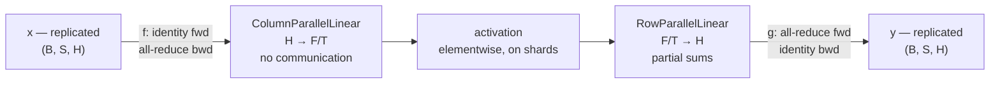

# 05 — Tensor parallelism

> Implemented by `parallel/tensor_parallel.py`, `autograd/collectives.py`.
> Tested by `tests/distributed/test_tensor_parallel.py`.

---

## 1. The idea in one matrix equation

A linear layer computes `Y = X Wᵀ + b` with `W ∈ ℝ^{O×I}`. There are exactly
two ways to cut `W` across `T` ranks, and they differ in which dimension of the
*product* each rank ends up owning.

### Column parallel — split the output features

```
W = [W_0 ; W_1 ; … ; W_{T−1}]      stacked along dim 0 (out_features)
W_t ∈ ℝ^{(O/T) × I}

Y_t = X W_tᵀ + b_t     ⟹   Y = [Y_0 | Y_1 | … ]   concatenated on features
```

Every rank needs the **whole** `X` and produces a **slice** of `Y`.

- **Forward:** no communication at all (given `X` already replicated).
- **Backward:** must all-reduce `∂L/∂X`, because each rank computed only its own
  contribution `Ȳ_t W_t`.

### Row parallel — split the input features

```
W = [W_0 | W_1 | … | W_{T−1}]      split along dim 1 (in_features)
W_t ∈ ℝ^{O × (I/T)}
X   = [X_0 | X_1 | … ]            split the same way

Y = Σ_t X_t W_tᵀ + b
```

Every rank needs a **slice** of `X` and produces a **partial sum** of the whole
`Y`.

- **Forward:** must all-reduce.
- **Backward:** no communication for `∂L/∂X_t`, because the all-reduced `Ȳ` is
  already identical everywhere.

The two are adjoints of each other in exactly the sense that matters: what
column parallel does in backward, row parallel does in forward.

---

## 2. The pairing that makes transformers cheap

A column-parallel layer *produces* feature shards; a row-parallel layer
*consumes* them. Chaining them costs **one** collective for the pair instead of
one per layer:



The activation in the middle is elementwise, so it operates happily on shards
and needs no communication. This is `TensorParallelFeedForward`, and the same
structure with attention heads in place of the hidden dimension is
`TensorParallelAttention`.

Total per block: **one all-reduce forward, one all-reduce backward**, versus
four if each layer gathered its own output.

---

## 3. `f` and `g`

The two autograd functions Megatron calls `f` and `g`:

| | Forward | Backward |
|---|---|---|
| `f` = `copy_to_group` | identity | all-reduce |
| `g` = `reduce_from_group` | all-reduce | identity |

Their derivations are in `02_collective_communication.md` §7. The short version:
`f` marks a tensor as *replicated*, so its gradient must be summed; `g` marks a
tensor as a *partial sum*, so its gradient is already complete.

Omitting `f`'s all-reduce is the classic bug. The forward pass is unaffected —
the model trains and the loss goes down — but every layer below the split
receives a gradient missing the other ranks' contributions.

---

## 4. Attention

Each rank owns `num_heads / T` **complete** heads. Because a head's computation
never crosses head boundaries, partitioning by head is exact: the concatenation
of the ranks' outputs *is* the unsharded output, and the output projection's
row-parallel reduction reassembles it.

```
q, k, v  : ColumnParallelLinear(H → H)      per rank: (B, S, H/T)
reshape  : (B, heads/T, S, head_dim)
scores   : q kᵀ / √d                        (B, heads/T, S, S)
softmax  : over the last dimension          — entirely within one head
context  : scores v                         (B, heads/T, S, head_dim)
reshape  : (B, S, H/T)
output   : RowParallelLinear(H → H)         all-reduce → (B, S, H)
```

`num_heads` must be divisible by `T`. Splitting a *head* would break the
softmax, which is computed over a whole head's scores; the error message says
so.

### Three projections, not one fused one

Megatron uses a single `ColumnParallelLinear(H → 3H)` for q/k/v, which is one
matmul instead of three. This project uses three separate projections, and the
reason is worth stating because it is a real trade-off.

A column-parallel split of a stacked `[Q; K; V]` matrix gives rank `t` a
*contiguous band* of rows `[t·3H/T, (t+1)·3H/T)`. Since the full matrix is
ordered `[Q(H rows); K(H rows); V(H rows)]`, that band is **not**
`(Q_t, K_t, V_t)` — with `T = 2`, rank 0 gets all of Q and half of K. Making it
work requires storing the full matrix in an interleaved-by-partition layout
`[Q_0;K_0;V_0;Q_1;K_1;V_1;…]`, which Megatron does.

The consequence is that the fused weight no longer corresponds element-wise to
an unsharded reference layer's weight, so the exact structural equivalence
tests in this repository would become impossible. Three projections keep the
weights directly comparable; the cost is two extra matmul launches per
attention block, which matters at scale and does not matter here.

---

## 5. Vocabulary parallelism

`VocabParallelEmbedding` splits the embedding table by vocabulary. Rank `t`
stores rows `[t·V/T, (t+1)·V/T)`. A lookup produces zeros for tokens outside
the local range, and a single all-reduce sums the contributions — exactly one
rank contributes a non-zero row per token, so the sum is the correct embedding.

```python
mask = (ids < self.vocab_start) | (ids >= self.vocab_end)
local = (ids - self.vocab_start).clamp_(0, self.embeddings_per_partition - 1)
embedded = F.embedding(local, self.weight).masked_fill(mask.unsqueeze(-1), 0.0)
return reduce_from_group(embedded, self.group)
```

The `clamp_` matters: without it, out-of-range indices would index out of
bounds before the mask is applied.

This is how a 256k-vocabulary embedding table stays off any single device.

---

## 6. Initialisation

Each rank draws the **whole** weight matrix from an identical seed and keeps
only its slice:

```python
with temporary_seed(derive_seed(init_seed, "tensor-parallel-init")):
    full_weight = torch.empty(out_features, in_features)
    init_linear_parameters(full_weight, full_bias, in_features=in_features)
weight_shard = split_tensor_along_dim(full_weight, 0, group.size)[group.local_rank]
```

The concatenation of the slices is then bit-for-bit what a single process would
have produced, which is what lets the tests assert *exact* structural equality
against an unsharded `nn.Linear`:

```
test_forward_is_exact            output_error == 0.0
test_weights_are_the_reference_sliced   full_weight_error == 0.0
test_weight_gradients_are_exact  weight_grad_error == 0.0
```

The alternative — each rank offsetting its seed and drawing only its own slice —
costs nothing but produces a different (equally valid) initialisation, making
exact equivalence untestable. Megatron does that and accepts the consequence.

`init_linear_parameters` reproduces `nn.Linear.reset_parameters` exactly
(`kaiming_uniform_(a=√5)` then a uniform bias over `±1/√fan_in`) rather than
inventing a scheme, so the comparison is against PyTorch's own initialisation.

Note the `in_features=` argument: a row-parallel shard's `weight.shape[1]` is
`I/T`, not the true fan-in, so the bias bound has to be passed explicitly or
every rank would use a different (wrong) bound.

---

## 7. Divisibility

`out_features` (column parallel), `in_features` (row parallel) and
`num_embeddings` (vocabulary parallel) must be divisible by `T`. Uneven splits
are **rejected**, not padded:

```
TensorParallelError: [rank 0] tensor_parallel.validate_divisible: out_features
must be divisible by the tensor-parallel size; an uneven split would give ranks
different shapes, which the single-buffer collectives cannot express and which
changes what a following bias or normalisation layer computes;
expected 'out_features % 3 == 0', observed 'out_features=16, remainder=1'.
Fix: choose out_features as a multiple of 3, or reduce the tensor-parallel size
```

Padding would be worse than an error. A padded feature dimension changes the
*mathematics*: a bias or a LayerNorm applied after an all-gather would treat the
padding as real features, and the padded positions would receive gradient and
be updated. Making it correct requires threading a mask through every
downstream operation. The error is the honest answer.

---

## 8. Which parameters are partitioned, and why the norm cares

Every parameter created by these layers is tagged:

| Layer | Parameter | Marked |
|---|---|---|
| `ColumnParallelLinear` | `weight` | partitioned, dim 0 |
| | `bias` | partitioned, dim 0 |
| `RowParallelLinear` | `weight` | partitioned, dim 1 |
| | `bias` | **replicated** |
| `VocabParallelEmbedding` | `weight` | partitioned, dim 0 |
| `SequenceParallelLayerNorm` | `weight`, `bias` | replicated |

The row-parallel bias is the one to watch. It is added **after** the reduction:

```python
partial = F.linear(x, self.weight, None)     # no bias here
output = reduce_from_group(partial, group)   # sum across ranks
output = output + self.bias                  # now add it, once
```

Adding it before the reduction would multiply it by `T`.

These markers drive the distributed gradient norm (`04_fsdp_style_sharding.md`
§7): a partitioned parameter's squared norms must be **summed** across the
group, a replicated one's must be **counted once**.

---

## 9. Measured results

`ColumnParallelLinear(12 → 16)` and `RowParallelLinear(16 → 12)`, Gloo, world
sizes 2 and 4, against `build_reference_linear` with the same seed:

| Quantity | `T=2` | `T=4` | Why |
|---|---|---|---|
| forward output (column, gathered) | `0.0` | `0.0` | each output feature computed by one rank with identical arithmetic |
| gathered weight vs reference | `0.0` | `0.0` | slices of the same draw |
| weight-shard gradient | `0.0` | `0.0` | local computation, no cross-rank sum |
| input gradient (column) | `1.2e-07` | `2.4e-07` | passes through an all-reduce |
| forward output (row) | `1.2e-07` | `2.4e-07` | forward *is* a cross-rank sum |
| replicated bias gradient (row) | `0.0` | `0.0` | full gradient on every rank |
| after one SGD step | `0.0` | `0.0` | identical inputs, identical update |

Whole-transformer results, 2 layers, 16 hidden, 4 heads, vocabulary 32:

| Quantity | Value |
|---|---|
| logits vs single process | `4.6e-07` |
| loss vs single process | `2.4e-07` |
| LayerNorm gradient (replicated) | `3.4e-08` |
| query weight gradient (partitioned) | `1.1e-08` |
| parameters per rank at `T=2` | 3056 of 5696 |

---

## 10. Communication cost

Per transformer block, with activations of `B×S×H` elements:

| Schedule | Forward | Backward |
|---|---|---|
| no parallelism | — | — |
| tensor parallel | 2 all-reduce (`2·B·S·H`) | 2 all-reduce |
| tensor + sequence parallel | 2 all-gather + 2 reduce-scatter | mirrored |

The last row moves the *same* bytes as the second — see
`06_sequence_parallelism.md` — while holding `1/T` of the inter-layer
activations.

Tensor parallelism's communication is proportional to **activations**, so it
grows with batch and sequence length and is issued *per layer*. FSDP's is
proportional to **parameters** and is issued per unit. That is why tensor
parallelism belongs inside a node (NVLink) and FSDP can span nodes.

---

## 11. Comparison with Megatron-LM

| Concern | Megatron-LM | This project |
|---|---|---|
| q/k/v projection | one fused `3H` column-parallel layer with interleaved layout | three separate layers, for weight comparability |
| Initialisation | per-rank draw of the local slice | full draw then slice, for exact equivalence |
| Uneven dimensions | not supported | not supported, with an explicit error |
| Sequence parallelism | fused, `--sequence-parallel` | same design, `sequence_parallel=True` |
| Gradient all-reduce for LayerNorm | `_allreduce_layernorm_grads` | `all_reduce_sequence_parallel_gradients`, driven by explicit markers |
| Fused kernels | fused softmax, bias+GeLU, fused LayerNorm | plain PyTorch operations |

The kernel fusion is the largest practical gap. Megatron's fused
bias+GeLU+dropout and fused softmax remove several full-activation round trips
to HBM per block. Reproducing them requires custom CUDA, which
`24_explicit_non_goals` in the project brief places out of scope; the effect is
quantified in `10_performance_engineering.md`.
