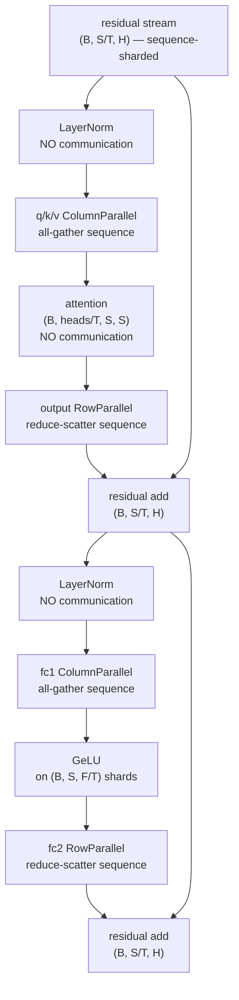

# 06 — Sequence parallelism

> Implemented by `parallel/sequence_parallel.py`, `models/transformer.py`.
> Tested by `tests/distributed/test_tensor_parallel.py::TestSequenceParallelOperations`
> and `::TestTransformerEquivalence`.

---

## 1. What it is, and what it is not

Activations in a transformer are `(batch, sequence, hidden)`. The five ways to
cut that tensor are routinely confused:

| Strategy | What is split | What is replicated |
|---|---|---|
| data parallel | `batch` | all parameters, all activations within a sample |
| **sequence parallel** | `sequence`, in the regions *between* tensor-parallel layers | parameters |
| tensor parallel | `hidden` (and the weight matrices) | the activations entering and leaving a parallel region |
| context parallel | `sequence`, **including inside attention**, via a ring or all-to-all exchange of keys and values | parameters |
| pipeline parallel | `layers` | nothing within a stage |

The distinction that matters most here is **sequence vs context parallelism**.

Sequence parallelism splits the sequence only where the computation is
**pointwise along the sequence**: LayerNorm, dropout, residual adds, elementwise
activations. Attention needs every position to see every other position, so a
sequence-parallel implementation **gathers the sequence back** before attention.

Context parallelism is the harder technique that keeps the sequence split
*through* attention by exchanging keys and values between ranks. It is out of
scope for this project and is discussed in §8.

**This project makes no claim that attention is communication-free under
sequence sharding. It is not.** The baseline implemented here gathers the
sequence at the entrance to each tensor-parallel region — which, in the fused
Megatron schedule, is *free*, because the column-parallel layer at that
entrance had to communicate anyway.

---

## 2. Why it is worth doing

Tensor parallelism leaves the LayerNorm/dropout/residual regions **replicated**:
every one of the `T` ranks stores the same `(B, S, H)` activation. Sequence
parallelism stores `(B, S/T, H)` on each rank instead, cutting that class of
activation memory by `T`.

The communication cost is **zero**, because of the identity

```
all-reduce  ≡  reduce-scatter  +  all-gather
```

A tensor-parallel block's all-reduce of `(B, S, H)` is replaced by a
reduce-scatter of `(B, S, H)` plus an all-gather of `(B, S, H)`, which move the
same number of bytes. Sequence parallelism is, in that sense, free activation
memory.

Concretely, for a 2-layer block with `B·S·H` activation elements:

| | replicated activation bytes per rank | collectives per block |
|---|---|---|
| tensor parallel only | `2 · B·S·H · 4` | 2 all-reduce |
| tensor + sequence parallel | `2 · B·S/T·H · 4` | 2 all-gather + 2 reduce-scatter |

---

## 3. The operations and their adjoints

| Operation | Forward | Backward |
|---|---|---|
| `scatter_sequence` | keep local slice (local) | all-gather |
| `gather_sequence` | all-gather | keep local slice |
| `gather_from_sequence_parallel_region` | all-gather | **reduce-scatter** |
| `reduce_scatter_sequence` | sum + keep slice | all-gather |

The third row is the one that is easy to get wrong; §7 of
`02_collective_communication.md` derives it. In short: when the gathered tensor
is consumed by a *different weight slice* on each rank, each rank holds only a
partial `∂L/∂Y`, so the adjoint must sum before slicing.

---

## 4. The flow through a transformer block



The residual stream stays sequence-sharded from end to end, so both residual
adds see matching shapes. The parallel regions in the middle work on the full
sequence with partitioned features.

### Shapes, with `T = 2`, `B = 4`, `S = 16`, `H = 64`

| Location | Shape on each rank |
|---|---|
| input token ids | `(4, 16)` |
| after embedding | `(4, 16, 64)` |
| after sequence scatter | `(4, 8, 64)` |
| after LayerNorm | `(4, 8, 64)` |
| after q/k/v column-parallel | `(4, 16, 32)` ← sequence gathered, features split |
| attention scores | `(4, 2, 16, 16)` ← 2 of the 4 heads |
| after attention output row-parallel | `(4, 8, 64)` ← reduce-scattered |
| after fc1 | `(4, 16, 64)` |
| after fc2 | `(4, 8, 64)` |
| logits | `(4, 16, 32000)` |

---

## 5. Why LayerNorm needs no communication

LayerNorm normalises over the **hidden** dimension:

```
y_{b,s,:} = γ ⊙ (x_{b,s,:} − μ_{b,s}) / √(σ²_{b,s} + ε) + β
```

The statistics `μ_{b,s}` and `σ²_{b,s}` are computed per `(batch, position)`
pair over the hidden axis only, so a rank holding positions `[s₀, s₁)` has
everything it needs for those positions.

Had the normalisation been over the *sequence* — as in some other
architectures — sequence sharding would have required an all-reduce of the
statistics. The freedom here is a property of LayerNorm, not of sequence
parallelism.

---

## 6. The gradient autograd cannot compute

The LayerNorm parameters `γ` and `β` are **replicated** across the group but
are only ever applied to this rank's positions. Their gradients are partial
sums over positions:

```
∂L/∂γ = Σ_{s=0}^{S−1} g_s = Σ_{r=0}^{G−1} [ Σ_{s ∈ P_r} g_s ]
                                            └─ what rank r computes ─┘
```

Nothing in the autograd graph performs the outer sum: `γ` is a leaf, and no
collective sits between it and the loss. It must be done explicitly after
backward:

```python
all_reduce_sequence_parallel_gradients(model, sequence_group)
```

`HybridModel.finish_backward()` does this first, before the DDP/FSDP reductions,
because reducing the sequence-parallel partials *after* a data-parallel average
would average incomplete gradients and then sum them — not the same number.

The same applies to a `RowParallelLinear`'s bias, which is added after the
reduce-scatter and therefore only ever sees this rank's sequence slice.

The affected parameters carry an explicit marker
(`mark_sequence_parallel_partial`) rather than there being a blanket rule,
because *without* sequence parallelism the same parameters are applied to the
whole sequence redundantly on every rank — their gradients are already complete,
and summing would multiply them by `G`.

This was a real bug during development. Before the fix:

| Quantity | error vs single process |
|---|---|
| logits | `4.6e-07` ✅ |
| LayerNorm gradient | `3.3e-02` ❌ |
| query weight gradient | `1.1e-02` ❌ |

After adding both the reduce-scatter adjoint and the explicit reduction:

| Quantity | error |
|---|---|
| logits | `4.6e-07` |
| LayerNorm gradient | `3.0e-08` |
| query weight gradient | `1.1e-08` |

A forward pass that matches perfectly while the gradients are wrong by 6 orders
of magnitude is exactly the failure mode this project's test design exists to
catch.

---

## 7. Uneven sequence lengths

The equal-size collectives require `S % G == 0`. Two options are provided:

**Strict** — `scatter_sequence` raises:

```
ShardingError: [rank 0] sequence_parallel.scatter_sequence: the sequence
dimension must be divisible by the sequence-parallel size; an uneven split would
give ranks different shapes and the equal-size collectives would mismatch;
expected '9 % 2 == 0', observed 1. Fix: call pad_sequence_dimension() before
scattering and unpad_sequence_dimension() after gathering
```

**Padded** — `pad_sequence_dimension` right-pads with zeros and returns a
`SequenceShardInfo` recording the original length; `unpad_sequence_dimension`
undoes it.

Under **causal** attention right-padding is harmless for the real positions:
position `i` attends only to `j ≤ i`, and every padded position has `j > i` for
all real `i`. The padded outputs are garbage and are discarded when the sequence
is un-padded. `TinyTransformer` therefore defaults to causal and takes this
path.

Under non-causal attention a key mask would be required. Rather than guess what
an arbitrary user-supplied mask should become when extended over padding, the
model refuses the combination:

```
UnsupportedFeatureError: an explicit attention mask combined with sequence
padding is not supported: the mask would have to be extended to cover the padded
positions, and its correct extension depends on what the mask means.
Fix: pad the batch to a multiple of the sequence-parallel size before calling
forward, or drop the explicit mask and rely on causal masking
```

---

## 8. What would be needed for context parallelism

Keeping the sequence split *through* attention requires every query block to
see every key/value block. Two standard approaches:

**Ring attention.** Keys and values are passed around a ring of `G` ranks in
`G` steps; each rank accumulates partial attention against the block it
currently holds, using the online-softmax trick to combine partial results
without materialising the full score matrix. Communication is `O(S·H)` per step
and overlaps with compute. `neighbour_ranks()` in `ParallelTopology` and the
`send_tensor`/`recv_tensor` wrappers exist to make this implementable, but the
attention itself is not written.

**All-to-all attention.** Before attention, an all-to-all converts the
sequence-split layout into a head-split layout; after attention, another
converts back. `all_to_all_tensor` exists for this. It moves more data than the
ring but in one shot, and the attention itself is then entirely local.

Both are genuinely harder than what is implemented here, and both change the
attention kernel rather than merely the surrounding plumbing. They are listed
as future extensions rather than being partially present.

---

## 9. Measured results

Transformer, 2 layers, `H=16`, 4 heads, vocabulary 32, world size 2, Gloo:

| Quantity | tensor only | tensor + sequence |
|---|---|---|
| logits vs single process | `4.6e-07` | `4.6e-07` |
| loss vs single process | `2.4e-07` | `2.4e-07` |
| LayerNorm gradient | `3.4e-08` | `3.0e-08` |
| query weight gradient | `1.1e-08` | `1.1e-08` |
| row-parallel bias gradient | `< 1e-06` | `< 1e-06` |
| parameters needing an explicit reduction | 0 | 14 |

The 14 is: 2 blocks × 2 LayerNorms × (weight + bias) = 8, plus the final norm's
2, plus 2 row-parallel biases × 2 blocks = 4.

`test_sequence_parallelism_matches_plain_tensor_parallelism` asserts the final
weights after 8 optimizer steps agree to `1e-05`: sequence parallelism is a
memory optimisation, not a model change.

---

## 10. Comparison with Megatron-LM

| Concern | Megatron-LM | This project |
|---|---|---|
| Enabling | `--sequence-parallel`, requires tensor parallelism | `sequence_parallel_mode: tensor_group` |
| Standalone sequence dimension | not offered | `sequence_parallel_mode: independent`, for teaching the mechanism in isolation |
| Sequence gather adjoint | `_GatherFromSequenceParallelRegion` with `tensor_parallel_output_grad` | `gather_from_sequence_parallel_region` |
| Partial LayerNorm gradients | `_allreduce_layernorm_grads` in `finalize_model_grads` | `all_reduce_sequence_parallel_gradients`, driven by per-parameter markers |
| Uneven sequences | caller's problem | `pad_sequence_dimension` with recorded metadata |
| Context parallelism | supported (`--context-parallel-size`) | not implemented; §8 describes what it needs |
