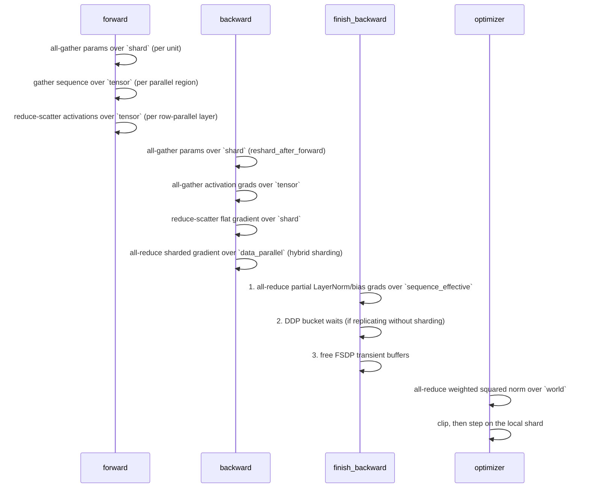
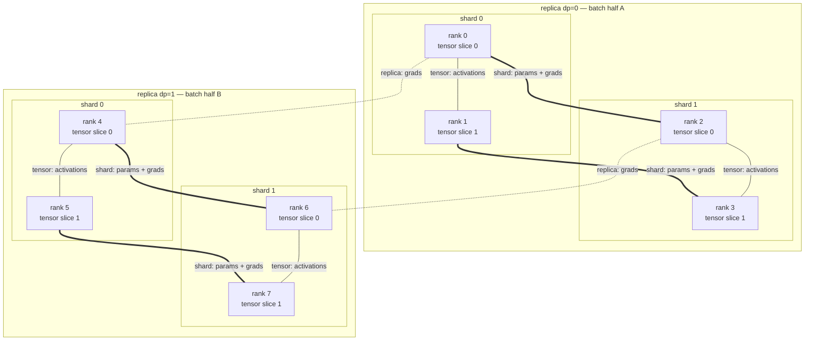

# 07 — Hybrid parallelism

> Implemented by `parallel/hybrid.py`, `distributed/topology.py`.
> Tested by `tests/end_to_end/test_training_scenarios.py::TestHybrid`,
> `tests/distributed/test_fsdp.py::TestHybridSharding`.

---

## 1. Why the strategies compose

The four strategies act on four *different* axes of the problem, so they are
orthogonal:

| Dimension | Splits | Leaves replicated |
|---|---|---|
| `tensor` | weight matrices, attention heads | the activations entering and leaving each region |
| `sequence` | activations along the sequence axis | every parameter |
| `shard` (FSDP) | parameters, gradients, optimizer state | the computation itself |
| `data_parallel` | the global batch | every parameter |

A model is therefore **built** with tensor and sequence parallelism baked into
its layers, and then **wrapped** for sharding and/or replication. The wrapper
never needs to know what the layers do; the layers never need to know how the
model is wrapped.

```python
model = build_model(config, context)          # TP/SP inside the layers
wrapped = HybridModel(model, config, context) # FSDP or DDP around it
```

---

## 2. Which group does what

This is the table that has to be right, because getting it wrong produces
training that converges to the wrong thing rather than an error.

| Quantity | Reduced over |
|---|---|
| tensor-parallel activations | `tensor` (all-reduce; or all-gather + reduce-scatter with sequence parallelism) |
| sequence-parallel partial parameter gradients | `sequence_effective` (all-reduce, SUM) |
| FSDP parameter all-gather | `shard` |
| FSDP gradient reduce-scatter | `shard` |
| replica gradient all-reduce | `data_parallel`, applied to the *already sharded* gradient |
| DDP gradient all-reduce | `data_parallel` |
| loss and metrics | `dp_shard` — **not** the world |
| global gradient norm | `world`, with per-parameter replication weights |
| checkpoint writer selection | ranks with `dp == 0` and `sequence == 0` |

Two rows deserve emphasis.

**Metrics over `dp_shard`, not the world.** Ranks in the same tensor/sequence
group processed the *same* samples. Averaging the loss over the world would
weight each sample by the tensor-parallel size. The number would still look
like a loss curve.

**The norm over the world, but weighted.** A hybrid job partitions parameters
over several dimensions at once, so every rank holds a piece of the total. The
per-parameter weighting (`04_fsdp_style_sharding.md` §7) is what keeps
replicated parameters from being counted more than once.

---

## 3. The ordering of collectives in one step



The ordering inside `finish_backward` is load-bearing: the sequence-parallel
completion must happen **before** any data-parallel averaging, because
averaging incomplete gradients and then summing them is not the same number as
summing and then averaging.

---

## 4. Worked example: 8 ranks, `dp=2 × shard=2 × tensor=2`

```
rank  dp sh tp   data_parallel  shard   tensor   dp_shard        gradient path
----  -- -- --   -------------  ------  -------  --------------  --------------------------
 0     0  0  0   (0, 4)         (0, 2)  (0, 1)   (0, 2, 4, 6)    RS over (0,2) → AR over (0,4)
 1     0  0  1   (1, 5)         (1, 3)  (0, 1)   (1, 3, 5, 7)    RS over (1,3) → AR over (1,5)
 2     0  1  0   (2, 6)         (0, 2)  (2, 3)   (0, 2, 4, 6)    RS over (0,2) → AR over (2,6)
 3     0  1  1   (3, 7)         (1, 3)  (2, 3)   (1, 3, 5, 7)    RS over (1,3) → AR over (3,7)
 4     1  0  0   (0, 4)         (4, 6)  (4, 5)   (0, 2, 4, 6)    RS over (4,6) → AR over (0,4)
 5     1  0  1   (1, 5)         (5, 7)  (4, 5)   (1, 3, 5, 7)    RS over (5,7) → AR over (1,5)
 6     1  1  0   (2, 6)         (4, 6)  (6, 7)   (0, 2, 4, 6)    RS over (4,6) → AR over (2,6)
 7     1  1  1   (3, 7)         (5, 7)  (6, 7)   (1, 3, 5, 7)    RS over (5,7) → AR over (3,7)
```

Reading the relationships:

- **Ranks 0 and 1** see the *same* data but different weight slices. They must
  receive identical input batches.
- **Ranks 0 and 2** see the same data and hold different shards of the same
  tensor slice. Their reduce-scatter is over `(0, 2)`.
- **Ranks 0 and 4** see *different* data and hold identical shards of the same
  slice. Their replica all-reduce is over `(0, 4)`.
- **Rank 0's loss** is averaged over `(0, 2, 4, 6)` — the four ranks that
  processed distinct samples for tensor slice 0.

This table is asserted by
`tests/unit/test_topology.py::TestCoordinates::test_documented_eight_rank_example`
and printed at run time by `examples/train_hybrid.py --show-topology`.



---

## 5. Ownership summary

For the 8-rank example, a model with a column-parallel weight `W` (partitioned
over `tensor`) and a LayerNorm gain `γ` (replicated over `tensor`):

| Object | Rank 0 holds |
|---|---|
| `W` | shard 0 of tensor-slice 0 — i.e. `1/4` of `W` |
| `γ` | shard 0 of the whole `γ` — i.e. `1/2` of `γ` |
| gradient of `W` | the same `1/4`, after reduce-scatter + replica all-reduce |
| optimizer state | two Adam buffers sized to rank 0's flat shard |
| activations | full sequence, tensor slice 0, batch half A |
| batch samples | half of the global batch (shared with ranks 1, 2, 3) |

Note that `γ` is *replicated* over `tensor` but still *sharded* over `shard`:
the flat parameter concatenates both kinds of tensor, which is exactly why the
gradient-norm weighting has to be per element.

---

## 6. Which wrapper is selected

`HybridModel` picks exactly one data-side strategy:

| Condition | Wrapper |
|---|---|
| `shard_parallel_size > 1` | FSDP over `shard`, with `data_parallel` as the replica group when it is wider than one rank |
| `shard == 1` and `data_parallel > 1` | the bucketed DDP implementation over `data_parallel` |
| neither | no wrapper; the model is used directly |

Tensor and sequence parallelism are already inside the layers, so they are not
part of this choice.

`describe_parallel_plan()` renders the resulting plan, and the examples print
it:

```
parallel strategy: fsdp+replicate+tensor+sequence
  parameters replicated over : ['data_parallel']
  parameters sharded over    : ['tensor', 'shard']
  activations sharded over   : ['tensor']
  gradient reduction order   :
      1. all-reduce of activation gradients (inside the layers, not of the weights) over 'tensor'
      2. reduce-scatter of flat gradients over 'shard'
      3. all-reduce of the sharded gradient over 'data_parallel'
  metrics reduced over       : 'dp_shard'
  note: ranks in the same tensor group must receive identical input batches
  note: hybrid sharding: memory scales with 1/shard_size only; the replica
        dimension buys communication locality, not memory
  note: reshard_after_forward=True: one extra all-gather per unit per step, in
        exchange for not holding the full parameters between forward and backward
  note: the whole module is one FSDP unit, so the transient all-gather buffer is
        the size of the entire model; set fsdp.auto_wrap_min_num_params to split it
  note: 2 micro-batches per optimizer step: the first N-1 run inside no_sync(), so
        the step costs one gradient reduction rather than N
```

The last three notes come from the *configuration*, not the topology: someone
reading the plan should be able to predict the collective count without opening
the YAML as well.

---

## 7. Data feeding

Ranks that share a `tensor_sequence` group are collaborating on one batch, so
they **must** receive identical input. Ranks in different `dp_shard` groups must
receive different input.

`DistributedBatchSampler` indexes by the `dp_shard` coordinate for exactly this
reason: all ranks generate the *same* permutation from the same seed and then
take disjoint slices of it, so the union of the ranks' micro-batches is exactly
the global batch.

`HybridModel.validate_input_replication(batch)` checks the guarantee at run
time with one broadcast and a comparison. It belongs in tests and debug runs,
not the hot loop:

```
ParameterConsistencyError: [rank 1] hybrid.validate_input_replication:
the input batch differs from the value held by group-local rank 0;
expected 'max |delta| <= 0.0', observed 'max |delta| = 2.431e+00'.
Fix: seed the model identically on every rank of this group, and broadcast
parameters at construction time
```

---

## 8. Random-number requirements

| Stream | Must be identical across | Must differ across |
|---|---|---|
| model initialisation | every rank | — |
| data order | every rank (they then take disjoint slices) | — |
| dropout / runtime randomness | `tensor_sequence` | `dp_shard` |

The last row is the subtle one: tensor-parallel peers compute complementary
halves of *one* sample and must draw the **same** dropout mask, while
data-parallel ranks process different samples and should not.

`TrainingEngine` seeds three streams accordingly:

```python
seed_everything(seed, stream="model-init")                                   # identical
seed_everything(seed, stream="runtime", index=ctx.group("dp_shard").local_rank)  # per data slice
# data order: DistributedBatchSampler derives from (data.seed, epoch), identical
```

---

## 9. Memory and communication as dimensions are added

Starting from a `P`-parameter model in fp32 with Adam and `A` activation bytes
per rank:

| Configuration | Parameters+state per rank | Activations per rank | Collectives per step |
|---|---|---|---|
| single | `16P` | `A` | 0 |
| `dp=R` | `16P` | `A` | `O(1)` all-reduce of `4P` |
| `shard=G` | `16P/G` | `A` | `O(units)` all-gather + reduce-scatter |
| `tensor=T` | `16P/T` (roughly) | `A` | `O(layers)` all-reduce of activations |
| `tensor=T` + sequence | `16P/T` | `≈ A/T` in the norm/residual regions | same bytes, different shape |
| `dp=R × shard=G` | `16P/G` | `A` | shard collectives + one replica all-reduce |
| `dp=R × shard=G × tensor=T` | `16P/(G·T)` | `A/T` in the sharded regions | all of the above |

The rules of thumb this table encodes:

- **Tensor parallelism** communicates *activations*, per layer, so it grows with
  batch and sequence length. Keep it inside a node.
- **FSDP** communicates *parameters*, per unit, so it is independent of batch
  size. It can span nodes.
- **Data parallelism** communicates *gradients*, once per step. Cheapest per
  step, saves no memory.
- **Hybrid sharding** buys locality, not memory: `16P/G`, with `G` the *shard*
  group only.

---

## 10. Preventing reduction over the wrong group

Three structural defences:

1. **No collective wrapper has a default group.** `all_reduce(tensor)` is a
   `TypeError`.
2. **Named groups, not integers.** `context.group("data_parallel")` cannot be
   confused with `context.group("shard")` the way `group=1` can be confused
   with `group=2`.
3. **The plan is rendered and asserted.** `describe_parallel_plan` states the
   reduction order, and the end-to-end tests assert on `metric_group.ranks` and
   `norm_group.size` rather than only on losses.

---

## 11. Measured results

MLP, 8 optimizer steps, global batch held at 8 samples so every configuration
consumes the same data:

| Configuration | ranks | strategy label | final weight-norm error vs single process |
|---|---|---|---|
| single | 1 | `single-process` | — (reference) |
| `dp=2` | 2 | `ddp` | `< 1e-05` |
| `shard=2` | 2 | `fsdp` | `< 1e-05` |
| `shard=4` | 4 | `fsdp` | `< 1e-05` |
| `dp=2 × shard=2` | 4 | `fsdp+replicate` | `< 1e-05` |
| `dp=2 × tensor=2` (transformer) | 4 | `ddp+tensor` | losses agree across all 4 ranks |
| `dp=2 × shard=2 × tensor=2` + SP | 8 | `fsdp+replicate+tensor+sequence` | losses agree across all 8 ranks |

`test_hybrid_matches_pure_sharding` additionally asserts that `dp=2 × shard=2`
and `shard=4` produce the same weights to `1e-06`: hybrid sharding and full
sharding are the same computation, differently scheduled.

The 8-rank test is marked `slow` and skipped automatically when the machine
cannot host 8 spawned ranks (each rank costs a full `import torch`); the skip
reason names the available memory and core count.

---

## 12. Comparison with production frameworks

| Concern | Megatron-DeepSpeed / Megatron-LM | PyTorch (DTensor + FSDP2) | This project |
|---|---|---|---|
| Layout abstraction | explicit `parallel_state` globals | `DeviceMesh` | `ParallelTopology` + named groups |
| Composition | TP + PP + DP + SP + CP | TP + FSDP via DTensor | TP + SP + FSDP + DP |
| Pipeline parallelism | yes | yes (`torch.distributed.pipelining`) | no |
| Group discipline | module-level singletons | mesh-derived | explicit handles, no defaults |
| Where the plan is written down | in the code | in the code | rendered at run time and asserted in tests |

The missing dimension is **pipeline parallelism**, which is genuinely different
in character: it partitions *layers* rather than tensors, needs micro-batch
scheduling (1F1B, interleaved), and introduces bubble overhead that the other
strategies do not have. It is listed as a non-goal rather than half-implemented.
