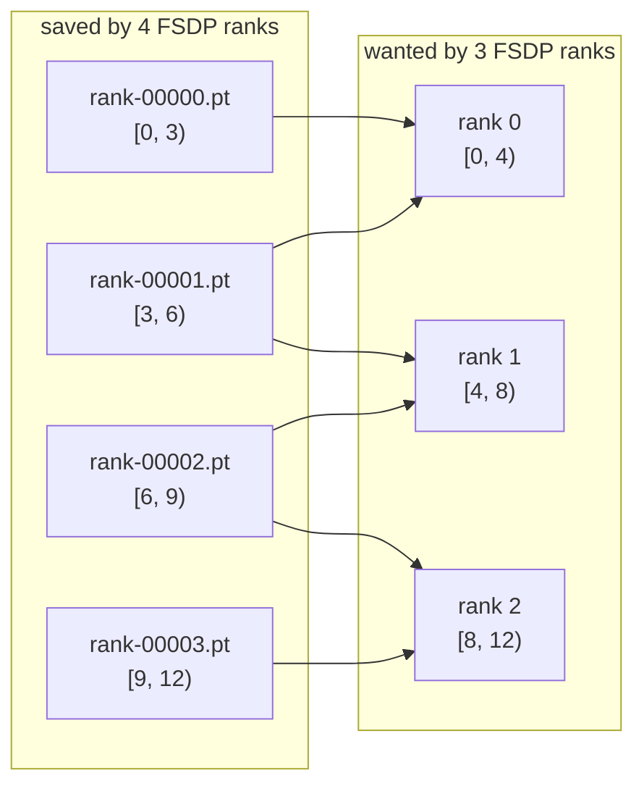
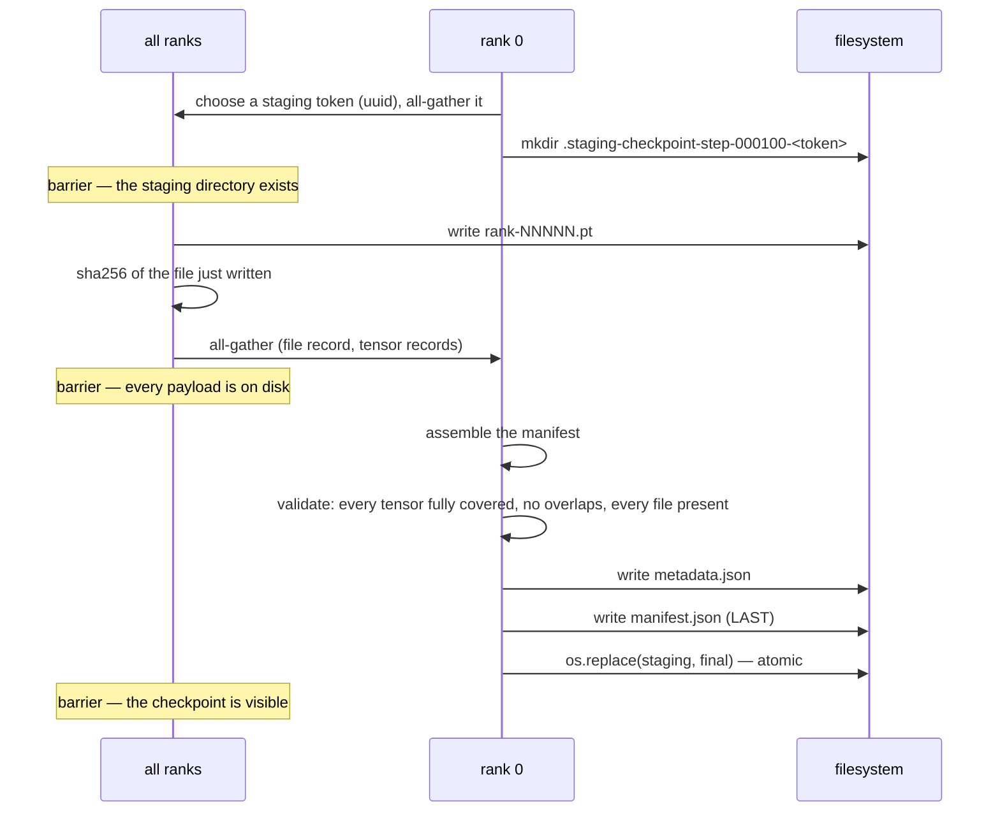

# 08 — Distributed checkpointing

> Implemented by `checkpoint/format.py`, `manifest.py`, `writer.py`,
> `reader.py`, `reshard.py`.
> Tested by `tests/unit/test_checkpoint_format.py`,
> `tests/integration/test_checkpoint.py`.

---

## 1. What a distributed checkpoint has to solve

Saving a sharded model is not "call `torch.save` on each rank". Three problems
appear immediately:

1. **No rank holds the whole model.** The checkpoint must describe *global*
   tensors assembled from pieces.
2. **The world size may change.** A job that saved on 64 ranks may resume on 32,
   or on 8 for evaluation. The format cannot bake in the writer's rank count.
3. **A write can be interrupted.** A reader must never mistake a half-written
   directory for a usable checkpoint.

---

## 2. Layout on disk

```text
checkpoint-step-000100/
├── manifest.json      what tensors exist, who owns which bytes, checksums
├── metadata.json      step, epoch, config, scheduler, scaler, RNG scalars
├── rank-00000.pt      tensor payload written by rank 0
├── rank-00001.pt
└── ...
```

**Two files, two jobs.** `manifest.json` and `metadata.json` are pure JSON: they
can be read, diffed, validated and inspected without `torch` installed and
without executing anything. Only the `rank-*.pt` files hold tensors, and they
are loaded with `weights_only=True`.

That split is the whole security story of the format: everything that decides
*what to do* is inert JSON, and everything PyTorch deserialises is plain tensor
data. See §9.

---

## 3. The manifest describes global tensors

Each tensor records its global shape and a list of shards; each shard records a
half-open interval `[offset, offset + length)` of that tensor's **row-major
flattening**, plus the file the bytes live in.

```json
{
  "format_version": "1.0",
  "writer_world_size": 4,
  "topology": {"world_size": 4, "sizes": {"data_parallel": 1, "shard": 4, ...}},
  "step": 100,
  "complete": true,
  "tensors": {
    "blocks.0.linear.weight": {
      "global_shape": [25, 14],
      "numel": 350,
      "dtype": "torch.float32",
      "category": "model",
      "shards": [
        {"rank": 0, "file": "rank-00000.pt", "offset": 0,   "length": 350,
         "key": "model::blocks.0.linear.weight@0", "padding": 0}
      ]
    }
  },
  "files": {
    "rank-00000.pt": {"sha256": "a3f1…", "bytes": 12904}
  }
}
```

Saved rank ids appear only as **provenance**. No reader keys off them.

---

## 4. Resharding is interval arithmetic

To load tensor `t` on a rank that wants elements `[a, b)`, intersect `[a, b)`
with every recorded shard interval and read the overlaps. Nothing in that
process refers to how many ranks wrote the checkpoint.

```text
saved by 4 ranks     |--0--|--1--|--2--|--3--|      3 elements each
wanted by 3 readers  |---0----|---1----|---2---|    4 elements each

reader 0 wants [0, 4)  → shard 0 fully ([0,3)) + shard 1 partially ([3,4))
reader 1 wants [4, 8)  → shard 1 partially ([4,6)) + shard 2 fully ([6,8))
reader 2 wants [8,12)  → shard 2 partially ([8,9)) + shard 3 fully ([9,12))
```



`describe_reshard()` exposes the plan without reading anything, which is what
`scripts/inspect_checkpoint.py --plan` prints:

```
read plan for 'blocks.0.linear.weight' (shape (25, 14))
  rank-00000.pt  saved by rank 0  shard=[0, 175]  overlap=[0, 175]
  rank-00001.pt  saved by rank 1  shard=[175, 175]  overlap=[175, 175]
```

`ShardFileCache` loads each payload file at most once. Without it, a checkpoint
with 200 tensors written by 8 ranks would perform up to 1600 `torch.load` calls.

---

## 5. What can and cannot change

| Change | Supported? | Why |
|---|---|---|
| `shard_parallel_size` (FSDP width) | **yes** | shards are global flat intervals; any width reads any other |
| `data_parallel_size` (replication) | **yes** | replicas hold identical data; a new replica reads the same bytes |
| sharding ↔ replication (FSDP ↔ DDP) | **yes** | both are ranges of the same global tensors |
| FSDP wrapping granularity | **yes** | names are wrapper-independent |
| `tensor_parallel_size` | **no** | rejected explicitly, see below |
| model architecture | **no** | shape mismatches reported per tensor |

### Why tensor-parallel width cannot change

Sharding *for memory* and partitioning *for computation* are different things.

An FSDP shard is an arbitrary contiguous range of a tensor's elements, chosen
purely to divide bytes evenly. Nothing in the model cares where the cut falls.

A tensor-parallel slice is a **mathematical decomposition**: rank `t` owns
output features `[tO/T, (t+1)O/T)` of a weight matrix and *computes* with them.
Worse, a **row-parallel slice is a set of strided columns**, which no single
`(offset, length)` interval can describe at all.

Converting between tensor-parallel widths therefore means re-deriving each slice
from the full matrix — a genuine tensor transformation, not a redistribution of
bytes. This reader refuses rather than guessing:

```
CheckpointTopologyError: [rank 0/2] checkpoint.load: the tensor-parallel width
differs between the checkpoint and this run. Tensor-parallel slices are a
mathematical decomposition of each weight matrix, not an arbitrary byte range,
and a row-parallel slice is a set of strided columns that no single
offset/length can describe; expected 'tensor_parallel_size == 1', observed 2.
Fix: resume with the original tensor-parallel size; to change it, load at the
original width, export a full state dict, and rebuild
```

Tensor-parallel slices are consequently stored as **distinct tensors**, keyed
`name#tpKofN`, each with its own global shape. Resharding across FSDP widths
still works *within* each slice.

---

## 6. The write protocol



**Why the manifest is written last.** A reader trusts exactly one thing: the
manifest. Writing it last means an interrupted save leaves a staging directory
with no manifest, which no reader will look at — the name begins with a dot and
the final path does not exist.

**Why the rename.** On a POSIX filesystem, within one mount point, a directory
rename is atomic. A concurrent reader sees either "no such directory" or the
complete checkpoint, never a half-populated one.

**Why validate before publishing.** `manifest.validate()` runs *before*
`os.replace`. A manifest that does not describe a complete, non-overlapping
cover of every tensor is never renamed into place, because a reader would trust
it.

The `complete` flag is belt and braces for a staging directory that does get
inspected.

**Why every failure in the protocol is broadcast.** Look at the diagram again
and notice how much of it happens on rank 0 alone: choosing the token, creating
the staging directory, assembling and validating the manifest, and the rename.
Each of those steps can fail, and each is immediately followed by a barrier that
*all* ranks enter.

That combination is a trap, and this project fell into it. The original code
did the obvious thing:

```python
if context.is_primary:
    if final_path.exists():
        raise CheckpointError(...)      # <-- rank 0 only
    staging_path.mkdir(parents=True, exist_ok=True)
context.barrier("world", label="checkpoint-staging-created")
```

Saving twice at the same step is supposed to produce a clean, recoverable
`CheckpointError`. What it actually produced was: rank 0 raises and unwinds out
of `save_checkpoint`, while ranks 1..N-1 walk into `barrier(...)` and block.
They stay blocked until rank 0's *process* exits and Gloo reports the broken
connection as `Connection closed by peer` — an error that names a TCP socket and
says nothing about duplicate checkpoints. A one-line fix on rank 0 had turned
into a hang on every other rank.

So the rule the writer now follows is:

> An error raised on one rank is not an error. It is a deadlock with an
> explanation on one node.

Every rank-0-only decision is therefore made *collectively*: rank 0 computes the
verdict, the verdict is all-gathered, and every rank raises the same
`CheckpointError` with the same message. There are three such points — the
destination-exists check, the staging `mkdir`, and the entire publish phase
(`_publish`, whose exceptions are caught, broadcast and re-raised everywhere).
The publish phase catches `Exception` rather than `CheckpointError` on purpose:
an `OSError` from a full disk must not become a hang either.

The cost is one extra all-gather of a small object per save. The benefit is that
the failure mode of a duplicate save is a message naming the directory, on every
rank, instead of a hang. `test_duplicate_save_rejected` asserts on *all* ranks'
results, which is what stops this regressing.

---

## 7. Who writes what

| Dimension | Policy |
|---|---|
| `shard` (FSDP) | every rank writes — they hold *different* elements |
| `tensor` | every rank writes — a slice is a distinct tensor with its own key |
| `data_parallel` | only coordinate 0 writes — the others hold byte-identical copies |
| `sequence` (independent mode) | only coordinate 0 writes — parameters are replicated across it |

Writing from every replica would multiply the checkpoint size by the
replication degree *and* force the manifest to describe overlapping shards,
which `validate()` rejects.

RNG state is the exception: it is genuinely per-rank, so every rank writes its
own outside the manifest's global-tensor space, and the metadata records which
ranks are present. A rank with no saved counterpart (because the world grew)
keeps its freshly seeded RNG and logs a warning — silently leaving it unchanged
would make the run non-reproducible without saying so.

That per-rank exception is also the one place where a reader opens a file the
interval arithmetic did not ask for. Rank *r* restores its RNG stream from
`rank-000rr.pt`, because that is where rank *r* wrote it. When resharding 4 → 2,
reader 0's parameter interval already covers `rank-00000.pt`, so it opens two
files; reader 1's interval covers ranks 2 and 3, so it opens `rank-00001.pt` as
a third. Two files of tensors, one of RNG. It is worth knowing about because
"how many files did the reader touch" is otherwise a clean proxy for "did the
interval index work", and this is the one term that does not come from the
index.

---

## 8. Optimizer state

Optimizer state is stored in the **same global coordinates as the parameters**.
Under FSDP an optimizer parameter is a flat shard spanning several model
tensors, so `optimizer_parameter_layout()` splits each state tensor by the flat
layout into per-parameter pieces keyed `name::exp_avg`.

That is what lets Adam moments be resharded across shard-group widths for free.
Without it, `exp_avg` would only be restorable at the world size that wrote it —
and resuming a large job with a fresh optimizer state loses the moment estimates
and produces a visible loss spike.

Non-tensor state (Adam's step counter) has no shape to shard, so it lives in
`metadata.json` as one value per state name. This implementation steps every
parameter together, so the values always agree; if they ever did not, silently
keeping one would corrupt the bias correction, so the disagreement is an error.

---

## 9. Security

Checkpoints are **trusted artefacts by default**, but the format is built so
that a checkpoint from an unknown source can be examined before anything is
deserialised.

| Risk | Mitigation |
|---|---|
| Arbitrary code execution via pickle | tensor payloads are loaded with `weights_only=True`, restricting unpickling to tensors and primitives |
| Manifest steering a read to an arbitrary path | every filename validated against `^rank-\d{5,}\.pt$`; `../../etc/passwd`, `/etc/shadow`, `subdir/rank-00000.pt` all rejected |
| Symlink escape from inside the directory | `resolve_inside()` resolves the path and asserts containment |
| Silent corruption | SHA-256 per file, verified on read; size checked first so truncation is reported as truncation |
| Type confusion from metadata | no type name from a checkpoint is ever imported or used to construct anything |
| Writes outside the target directory | the writer only ever creates files under the staging directory it made |

**`weights_only=True` is a real reduction in attack surface, not a guarantee.**
A malicious checkpoint can still cause a large allocation or a shape confusion.
The files that must only be loaded from trusted sources are the `rank-*.pt`
payloads; `manifest.json` and `metadata.json` are safe to parse from anywhere,
which is why `inspect_checkpoint()` reads only those unless asked otherwise.

`scripts/inspect_checkpoint.py` never calls `torch.load`. It can validate
structure and checksums on a checkpoint you do not trust.

---

## 10. Failure modes and their errors

Every one of these is exercised by
`tests/integration/test_checkpoint.py::TestIntegrity`, which damages a *real*
checkpoint on disk rather than constructing a synthetic manifest.

| Damage | Detected as |
|---|---|
| payload file deleted | `IncompleteCheckpointError: a shard file listed in the manifest is missing` |
| payload truncated | `CheckpointCorruptionError: … has the wrong size, so it was truncated or overwritten` |
| one byte flipped | `CheckpointCorruptionError: … failed checksum verification` |
| manifest deleted | `IncompleteCheckpointError: no manifest found; the manifest is written last, so its absence means the checkpoint was never completed` |
| `complete: false` | `IncompleteCheckpointError: the manifest is not marked complete` |
| unknown `format_version` | `CheckpointVersionError: unsupported checkpoint format version` |
| a shard record removed | `IncompleteCheckpointError: the shards of 'x' do not cover the whole tensor` |
| two shards overlapping | `CheckpointCorruptionError: the shards of 'x' overlap, so two files claim the same elements` |
| hostile filename | `CheckpointError: … does not match the shard naming rule` |
| tensor-parallel width changed | `CheckpointTopologyError`, quoted in §5 |
| model shape changed | `CheckpointError: tensor 'x' has a different shape in the checkpoint` |
| saving twice at one step | `CheckpointError: the destination checkpoint already exists`, raised **on every rank** (see §6) |

---

## 11. Measured results

MLP with 583 parameters (`input=10, hidden=17, layers=2, output=5`), AdamW,
Gloo:

| Scenario | Result |
|---|---|
| save at step 3 with 2 FSDP ranks, resume with 2 | final weights **bitwise identical**; losses identical |
| save with 4 FSDP ranks, resume with 2 | restored parameters **bitwise identical** to the saved ones; after 3 more steps, `3.0e-08` (fp32 reduction-order difference only) |
| save with 2, resume with 4 | same |
| save with FSDP, resume with DDP | restored parameters bitwise identical |
| save with `dp=2 × shard=2`, resume with `shard=4` | restored parameters bitwise identical |
| files read when 4 → 2 | 2 payload files per reader, exactly as the interval intersection predicts, plus this rank's own file when the RNG stream is not already among them (see below) |
| optimizer state after a 2-rank resume | `2 × 292` elements — two Adam moments over the *local shard*, not the global `2 × 583` |

**A caveat that caught the first version of the reshard example.** Comparing
*post-resume training* across world sizes is only meaningful if the global batch
is held constant. Changing the rank count while keeping `micro_batch_size` fixed
changes the global batch (16 vs 8), so the two runs solve different
optimisation problems and diverge — not because resharding was wrong.
`examples/resume_with_different_world_size.py` scales `micro_batch_size`
inversely with the rank count for exactly this reason, and says so.

---

## 12. Comparison with `torch.distributed.checkpoint`

| Concern | PyTorch DCP | This project |
|---|---|---|
| Sharding description | `ShardedTensor` / `DTensor` metadata | flat global intervals |
| Resharding | supported, planner-driven | supported for shard/replica widths; TP width rejected |
| Format | `.metadata` (pickled) + `__N_N.distcp` | JSON manifest + `.pt` payloads |
| Inspectable without torch | no | yes — manifest and metadata are plain JSON |
| Integrity checks | none built in | SHA-256 per file, size check, coverage validation |
| Atomicity | caller's responsibility | staging directory + atomic rename |
| Asynchronous save | supported (`async_save`) | not implemented |
| Storage backends | pluggable (fsspec, S3) | local filesystem only |

The two gaps that matter at scale are **asynchronous save** (which overlaps the
write with the next training steps, important when a checkpoint takes minutes)
and **pluggable storage**. Both are engineering rather than conceptual work.

The integrity checking and the JSON-inspectability are places where this format
is deliberately *stricter* than DCP: a checkpoint that fails validation here is
never published, and one that is corrupted afterwards is never silently loaded.
